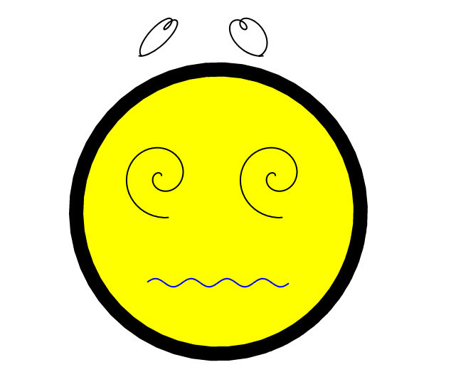

#SVG Coordenadas Paramétricas
## Curvas usadas

    Theta:
    - parametrização ex: de -100 a 100

    Frame:
    - variavel incremental
    - usada para modificar as funções de um frame para o outro

    Carinha:
    - x: cos(theta)*200
    - y: sen(theta)*200

    Olhos:
    - x: Math.cos((theta-frame))* index)
    - y: Math.sin((theta-frame))* index)

    Boca:
    - x: theta*8
    - y: Math.sin(theta)*Math.sin(frame)*6

    Corações:
    - x: Math.sin(theta + frame) * index + Math.sin(frame) * 100
    - y: -1 * (Math.cos(theta) * index) + 256

## Resultado

## Referencias

- STEWART, J. Cálculo. Vol. 2. 7a ed. São Paulo: Cengage Learning, 2009.
- W3Schools https://www.w3schools.com/graphics/svg_intro.asp acessado em 05 de julho de 2019
